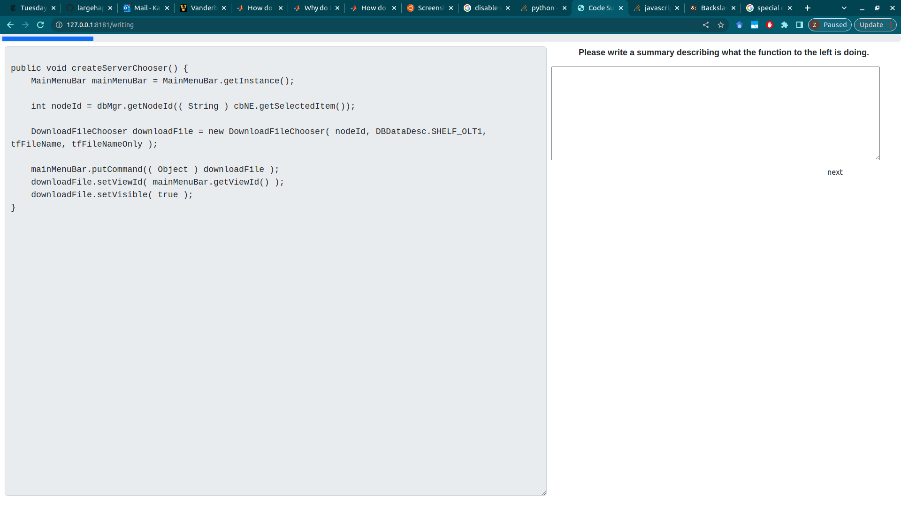

### Eye-tracking Tutorial for Code Comprehension
My goal with this tutorial is to show other lab-members/researchers how to map raw eye-tracking coordinates to code on the computer monitor. From here, there may be language-specific parsers you can use to discern some semantic information from the code (i.e., srcML in Java).

#### Step 0. Data Inputs
There should be two primary forms of data input for mapping gaze coordinates to the stimuli: raw eye-tracking files and screenshots of the stimuli. 

  

This image shows eye-tracking data from a Tobii eye-tracker. In the red box are x and y coordinates for the left and right eye separately. To get a single gaze coordinate, I average the x coordinates with one another, and the y coordinates with one another. In the blue box is the timestamp for the gaze coordinate. 

  

As I was logging the eye-tracking data, I also recorded the stimulus that the participant was completing. The eye-tracking data above is from this stimulus, the createServerChooser method. If you're analyzing multiple participants and multiple stimuli, you'll just need a way of looping through them to find the corresponding stimuli/eye-tracking data.

#### Step 1. Drawing Bounding Boxes
In general, these steps describe how I solved the problem of mapping gaze data to code, but there are likely other, more efficient methods for doing this. My method for drawing bounding boxes around tokens in the code was to use Optical Character Recognition (OCR). For this to work, you'll first need to isolate the part of the screenshot where 

