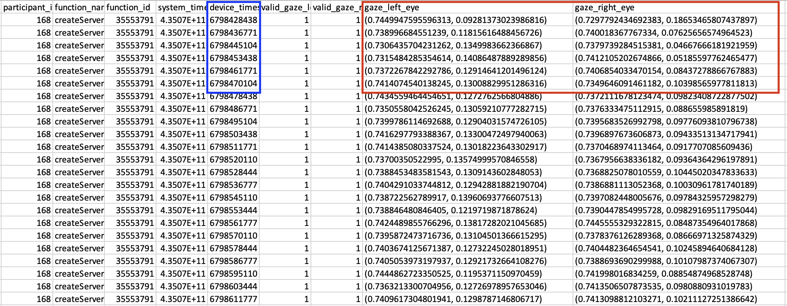
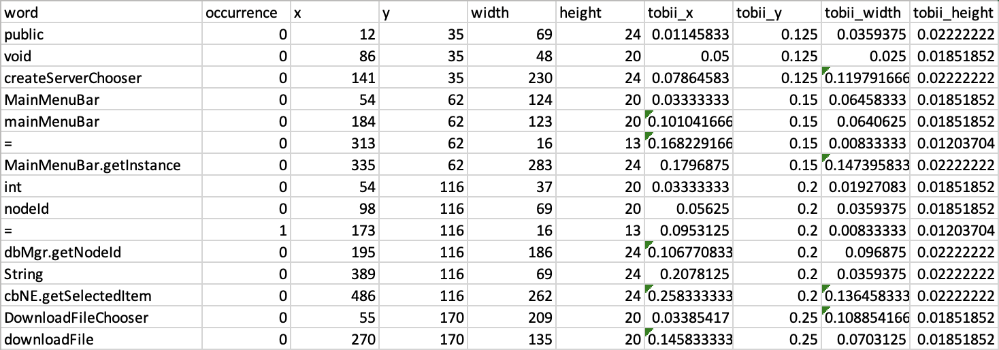

### Eye-tracking Tutorial for Code Comprehension
My goal with this tutorial is to show other lab-members/researchers how to map raw eye-tracking coordinates to code on the computer monitor. Here's a [link]([https://www.youtube.com/watch?v=YYD1adNJCVY&ab_channel=ZacharyEKaras](https://www.youtube.com/watch?v=YYD1adNJCVY&ab_channel=ZacharyEKaras)) to a video where I walk through the process. There may be language-specific parsers you can use to discern some semantic information from the code (i.e., srcML in Java). In general, these steps describe how I solved the problem of mapping gaze data to code, but there are likely other, more efficient methods for doing this. Unfortunately, this process also requires manual correction between the different steps. In this tutorial I tried to specify where this correction is necessary, and what types of correction you'll need to do.
If you have any questions, feel free to email me at z.karas@vanderbilt.edu

#### Step 0. Data Inputs
There should be three primary forms of data input for mapping gaze coordinates to the stimuli: raw eye-tracking files, screenshots of the stimuli, and a textual representation of the text/code that can serve as the ground truth. 

  

This image shows eye-tracking data from a Tobii eye-tracker. In the red box are x and y coordinates for the left and right eye separately. To get a single gaze coordinate, I average the x coordinates with one another, and the y coordinates with one another. In the blue box is the timestamp for the gaze coordinate. 

  

As I was logging the eye-tracking data, I also recorded the stimulus that the participant was completing. The eye-tracking data above is from this stimulus, the createServerChooser method. The ground truth code is located in a spreadsheet called `pruned_seeds2.csv`. 

If you're analyzing multiple participants and multiple stimuli, you'll just need a way of looping through them to find the corresponding stimuli, eye-tracking data, and ground truth code.

#### Step 1. Drawing Bounding Boxes (1_draw_boxes.ipynb)
My method for drawing bounding boxes around tokens in the code was to use Optical Character Recognition (OCR). For this to work, you'll first need to isolate the part of the screenshot where the code is located. For these screenshots, I found I needed to cut off 100px from the left, 1000px from the right, 10px from the top, and 1150px from the bottom. 

  

This code is all within the jupyter notebook script, but next you can draw the bounding boxes around the tokens in the code using easyocr.

  

The rest of the script then isolates the text within each bounding box, performs preprocessing, and uses OCR to try to identify the characters. 
For instance, OCR correctly identifies the text in this image to be 'createServerChooser( )'. This script also saves the bounding box coordinates associated with each token into a csv file, which is located in the word_coordinates folder. 

  

Using OCR is mostly accurate, but not entirely. There may be some unknown characters that require manual labeling, OCR may add spaces or mis-identify capital vs. lowercase letters, etc. These are addressed in the next steps. Mainly, we want to match the characters from the bounding boxes to the ground truth code.

*Before moving on to the next step, manually change the names of the x_unknown words in the csv files to match the text within the temp images (labeled unknown_x)*

#### Step 2. Matching images to code (2_match_code.py)
This step can be run from the terminal with `python 2_match_code.py`, but it tries to perform a variation of spell check on the strings recognized using OCR, comparing them to the closest match within the ground truth code. If there isn't a clear match, this script fills in the string as a set of dashes, and requires manual labeling.

  

#### Step 2.5. Manual Correction
Before moving on to the next step, perform some manual correction on the csv files. This entails looking at the dashes within the "word" column and entering correct values. For instance, `MainMenuBar.getInstance()` isn't split at the period with OCR, but gets duplicated when performing spell check. As a result, one row is MainMenuBar and the next is MainMenuBar.getInstance() with the same coordinates. These dot operators are handled in step 3.5, so here you'll want to delete the duplicate boxes. For other dashes, you can see it's usually an issues with the bounding box(es) above or below. It's often an issue with the dot operators, so double check with the image in the "temp" folder, and assign the corect values (i.e., `DBDatadesc` --> `DBDatadesc.SHELF_OLT1`). 

  

#### Step 3. Preprocess Bounding Boxes (3_bounding_box_preprocessing.ipynb)
Next, we want to get rid of the trailing and leading parentheses, brackets, semi-colons, etc. from the code to get the text by itself (i.e., `createServerChooser( )` --> `createServerChooser`). Also, some tokens may be repeated within the code (i.e., multiple equal signs within a method). We want to enumerate these duplicates (i.e., `=.0`, `=.1`, `=.2`). Finally, this may be specific to Tobii eye-trackers, but their coordinates are recorded between a range of 0-1, not using the raw pixel values. Using OCR records the raw pixel values, so this step normalizes these to be within 0 and 1. In the image below, in the red box you can now see that createServerChooser no longer has the parentheses afterwards. In the orange box are examples of the occurrences of each token, and in the blue box are the same coordinates normalized to be within 0 and 1. 

  

#### Step 4. Splitting by Dot Operators but not by Comments (4_split_bounding_boxes.ipynb)
This next script tries to split the dot operators, and concatenate strings and comments, which were split by OCR. Based on the width of the boxes and the number of characters therein, this script creates a new box for the string after the dot operator. 

  

**If you're using something like srcML to get some semantic context for code, you can add that step here to modify the word_coordinates files. I'll add some steps at the end for how to do that. If you're using srcML to parse, you'll need to manually check to make sure the tokens in the word_coordinate files line up with the output AST nodes (which can be tedious).**

#### Step 5. Localize Gaze to Code (5_localize_gaze.py)
Now that we've made the bounding boxes and found coordinates for the different parts of the code, we can localze the gaze coordinates from our eye-tracking file to these boxes. This step takes a while to run, but uses geopandas to make shapes out of each bounding box, then finds the rectangle in which each gaze coordinate lands. This is then recorded in a new annotated gaze file, which is a copy of the original gaze file. In this new file, however, there are new columns added for each token in the code. If the participant looked at a token in the code, there will be a 1 in that column for that timestamp. 
In this localize gaze script, I also add new boxes for different Areas of Interest (AOIs), which can be customized for your own task.

  

#### Adding AST Context
To add AST context to each token in the code, I used srcML. My study involved standalone methods that couldn't be parsed on their own. As a workaround, I used the ChatGPT API for wrapping each method in the required code so that it could be parsed. This code for wrapping methods is located in `4.1_maketrees.py`. Next, we can use srcML to parse these methods into xml trees corresponding to the Abstract Syntax Tree (located in `4.2_parse.py`). Finally, we can recursively walk through the trees and add context to each token `4.3_make_AST.py`.

